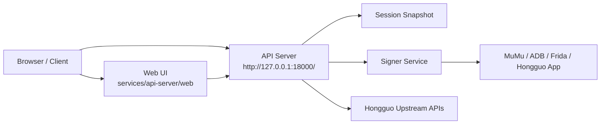

# DramaFlux

> 面向红果内容检索与播放地址解析的本地协作项目，采用 API Server + Signer Service 分层架构。


> [!TIP]
> `README.md` 只负责项目门面、快速开始和架构概览。DramaFlux 的部署流程与环境准备以 [DEPLOYMENT.md](DEPLOYMENT.md) 为主，服务细节看各服务 README，故障排查看 [docs/troubleshooting.md](docs/troubleshooting.md)。

## 概览

DramaFlux 由两个可独立部署的 Python 服务和一个共享 contracts 包组成：

| 组件 | 位置 | 职责 |
| --- | --- | --- |
| API Server | `services/api-server` | 提供本地 HTTP API、托管 Web 页面、管理 session、调用 Signer、解析上游响应 |
| Signer Service | `services/signer-service` | 管理 MuMu / ADB / Frida / App attach，并生成动态签名材料 |
| Shared Contracts | `packages/hongguo-contracts` | 维护两个服务共享的版本化 HTTP 数据模型 |

服务边界保持明确：

- API Server 不引入设备控制、Frida 注入或签名算法实现。
- Signer Service 不承担搜索、详情、排行或播放地址解析等业务逻辑。
- 跨服务协议变更先改 `packages/hongguo-contracts`，再同步更新双方实现与测试。

## 核心能力

- 搜索、上新、排行、详情、分集与视频地址相关 API。
- 本地 session 捕获与复用，避免将会话逻辑散落到业务层。
- 由 Signer Service 串行处理动态签名，API Server 只消费签名结果。
- 托管开放平台 Web 页面，并支持前端独立开发联调。

## 系统架构



> [!IMPORTANT]
> 上游请求必须先确定最终 URL、Header 和请求体，再调用 Signer；签名完成后不得修改签名材料。

## 仓库结构

```text
.
|-- services/
|   |-- api-server/
|   |   `-- web/
|   `-- signer-service/
|-- packages/
|   `-- hongguo-contracts/
`-- docs/
```

- 前端源码目录：`services/api-server/web`
- API Server 托管的页面入口：`http://127.0.0.1:18000/`
- 前端开发态入口：`http://127.0.0.1:5173`

## 快速开始

1. 安装 Python 3.10+、`uv`，并准备好 MuMu、ADB、Frida 与已登录的红果 App。
2. 在仓库根目录安装依赖：

```powershell
$env:UV_CACHE_DIR="$PWD\.uv-cache"
uv sync --all-packages
```

3. 按顺序启动并联调：
   - 先准备一组共享 token，并启动 Signer Service：

```powershell
$env:HONGGUO_SIGNER_SERVICE_TOKEN="<your-token>"
$env:HONGGUO_API_SIGNER_TOKEN=$env:HONGGUO_SIGNER_SERVICE_TOKEN
.\services\signer-service\scripts\start.ps1
```

   - 捕获本地 session：`.\services\api-server\scripts\capture_session.ps1`
   - 启动 API Server：`.\services\api-server\scripts\start.ps1`
   - 需要前端热更新时，再进入 `services/api-server/web` 启动 Vite dev server

> [!NOTE]
> 这里故意只保留协作所需的最短路径。部署流程与环境变量以 [DEPLOYMENT.md](DEPLOYMENT.md) 为主，服务实现与本地细节看 `services/api-server/README.md`、`services/signer-service/README.md`，排障说明看 [docs/troubleshooting.md](docs/troubleshooting.md)。

## 常用入口

| 用途 | 地址 / 路径 |
| --- | --- |
| 前端源码 | `services/api-server/web` |
| 前端开发态 | `http://127.0.0.1:5173` |
| API Server 托管页面 | `http://127.0.0.1:18000/` |
| API 健康检查 | `http://127.0.0.1:18000/health` |
| Signer 健康检查 | `http://127.0.0.1:18001/v1/health` |

## 开发与验证

根目录离线验证命令：

```powershell
$env:UV_CACHE_DIR="$PWD\.uv-cache"
uv run ruff check .
uv run pytest -q
```

前端联调时，Vite 通过本地代理将 `/api` 和 `/health` 转发到 `http://127.0.0.1:18000`。更细的服务级说明请分别查看：

- [services/api-server/README.md](services/api-server/README.md)
- [services/signer-service/README.md](services/signer-service/README.md)
- [DEPLOYMENT.md](DEPLOYMENT.md)
- [docs/troubleshooting.md](docs/troubleshooting.md)

## 文档索引

| 文档 | 用途 |
| --- | --- |
| [DEPLOYMENT.md](DEPLOYMENT.md) | DramaFlux 的部署文档，涵盖环境准备、启动顺序、验证与运维注意事项 |
| [services/api-server/README.md](services/api-server/README.md) | API Server 与 Web 的服务级说明 |
| [services/signer-service/README.md](services/signer-service/README.md) | Signer Service 的服务级说明与设备侧依赖说明 |
| [docs/troubleshooting.md](docs/troubleshooting.md) | 常见故障定位与排查建议 |

## 项目边界

- 不实现 X-Argus / X-Gorgon 离线算法。
- 不处理 DRM / CENC 解密。
- `/api/videos/{video_id}` 返回红果 APP 提供的播放地址；若上游只给出加密流，API 会按现有约定标记受限状态，而不是尝试解密。
- 服务默认监听回环地址；Signer Service 不能作为匿名公网签名服务暴露。
