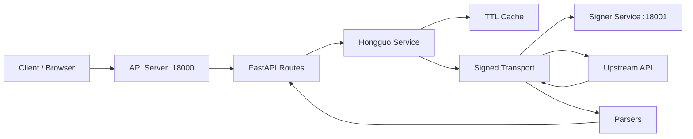

# DramaFlux API Server

`services/api-server` 是 DramaFlux 开放平台的业务服务层。

它负责：

- 提供稳定的本地 HTTP API
- 读取和使用本地会话快照
- 调用 Signer Service 获取动态签名
- 请求上游短剧平台并解析返回结果
- 托管开放平台 Web 页面

它不负责：

- Frida、ADB、MuMu、设备控制
- 上游签名算法实现
- DRM / CENC 解密

这些能力由 `services/signer-service` 独立承担。

## 目录

- [能力范围](#能力范围)
- [服务结构](#服务结构)
- [开放平台 Web](#开放平台-web)
- [HTTP API](#http-api)
- [环境变量](#环境变量)
- [本地启动](#本地启动)
- [前端开发](#前端开发)
- [测试与校验](#测试与校验)
- [当前限制](#当前限制)

## 能力范围

当前 API Server 提供以下业务能力：

- 搜索短剧
- 获取最新短剧
- 获取排行榜
- 获取短剧详情
- 获取短剧剧集列表
- 解析视频播放地址
- 统一成功/失败响应格式
- 基于 TTL 的只读缓存
- 开放平台首页、接口文档页、定价页

## 服务结构



关键约束只有一条：

> 请求 Signer 时看到的最终 URL、Header 和请求体字节，必须与真正发给上游的内容一致。

因此 API Server 会先完成最终请求构造，再获取签名，签名完成后不再修改签名材料。

## 开放平台 Web

API Server 内置了一个 React Web，不需要单独部署前端服务即可由 FastAPI 对外提供页面。

当前页面：

- `/`：开放平台首页
- `/docs`：接口文档与在线调试
- `/pricing`：定价购买页

保留的内部文档入口：

- `/internal/docs`
- `/redoc`
- `/openapi.json`

前端实现位置：

```text
services/api-server/web
```

构建产物输出到：

```text
services/api-server/src/hongguo_api/web_dist
```

接口文档页的在线调试直接请求当前同源下的 `/api/*` 与 `/health`，在本地开发模式下由 Vite 代理到 `http://127.0.0.1:18000`。

定价页中的购买交互目前仅用于展示，不会创建真实订单，也不会发起真实支付。

## HTTP API

当前公开业务接口：

```text
GET /health
GET /api/search?q=&page=&page_size=&cursor=
GET /api/latest?genre=short_play&today_only=true&page=&page_size=&cursor=
GET /api/rank?board=hot&page=&page_size=&cursor=
GET /api/books/{series_id}
GET /api/books/{series_id}/episodes
GET /api/videos/{video_id}?quality=1080p&fast=true
```

当前路由实现在 [routes.py](/D:/Codex/hongguo-video/services/api-server/src/hongguo_api/api/routes.py)。

示例：

```powershell
Invoke-RestMethod "http://127.0.0.1:18000/health"
Invoke-RestMethod "http://127.0.0.1:18000/api/search?q=都市甜宠&page=1&page_size=30"
Invoke-RestMethod "http://127.0.0.1:18000/api/books/7647789981687106622"
Invoke-RestMethod "http://127.0.0.1:18000/api/videos/7647791842397801534?quality=1080p&fast=true"
```

成功响应格式：

```json
{
  "code": 200,
  "message": "success",
  "data": {},
  "cached": false,
  "request_id": "19f9550e-5b77-4131-850d-768ee73f4c95"
}
```

常见错误码：

| HTTP | code | 含义 |
| --- | --- | --- |
| `400` | `invalid_cursor` | 分页游标无效 |
| `401` | `session_expired` | 上游会话已过期 |
| `404` | `book_not_found` | 短剧不存在 |
| `404` | `video_not_found` | 视频不存在 |
| `422` | `encrypted_stream_unsupported` | 仅存在加密流 |
| `429` | `risk_controlled` | 上游风控 |
| `502` | `upstream_invalid_response` | 上游响应异常 |
| `503` | `session_missing` | 尚未捕获会话 |
| `503` | `signer_unavailable` | Signer Service 不可用 |
| `504` | `upstream_timeout` | 上游请求超时 |

## 环境变量

参考 [`.env.example`](/D:/Codex/hongguo-video/services/api-server/.env.example)：

```dotenv
HONGGUO_API_SIGNER_URL=http://127.0.0.1:18001
HONGGUO_API_SIGNER_TOKEN=local-development
HONGGUO_API_SESSION_FILE=.local/session.json
HONGGUO_API_TIMEOUT_SECONDS=30
```

| 变量 | 默认值 | 说明 |
| --- | --- | --- |
| `HONGGUO_API_SIGNER_URL` | `http://127.0.0.1:18001` | Signer Service 地址 |
| `HONGGUO_API_SIGNER_TOKEN` | `local-development` | 服务间 Bearer Token |
| `HONGGUO_API_SESSION_FILE` | `.local/session.json` | 本地会话快照路径 |
| `HONGGUO_API_TIMEOUT_SECONDS` | `30` | 上游 HTTP 超时秒数 |

## 本地启动

### 1. 准备 Signer Service

先启动 MuMu、目标 App 和 `services/signer-service`。

健康检查：

```powershell
Invoke-RestMethod http://127.0.0.1:18001/v1/health
```

### 2. 设置共享 token

```powershell
$env:HONGGUO_API_SIGNER_TOKEN="local-development"
```

API Server 和 Signer Service 必须使用相同 token。

### 3. 捕获会话

脚本：

```text
services/api-server/scripts/capture_session.ps1
```

用法：

```powershell
$env:HONGGUO_API_SIGNER_TOKEN="local-development"
.\services\api-server\scripts\capture_session.ps1
```

捕获成功后会写入：

```text
.local/session.json
```

会话文件可能包含 cookie、设备标识或 token，不能提交到 Git，也不应写入日志。

### 4. 启动 API Server

脚本：

```text
services/api-server/scripts/start.ps1
```

从仓库根目录执行：

```powershell
$env:HONGGUO_API_SIGNER_TOKEN="local-development"
.\services\api-server\scripts\start.ps1
```

等价命令：

```powershell
uv run --project services/api-server uvicorn hongguo_api.bootstrap_app:app --host 127.0.0.1 --port 18000
```

默认仅监听 `127.0.0.1`，不要直接暴露为匿名公网服务。

## 前端开发

Web 工程使用 React 19、React Router 7、Vite 6、Vitest。

首次安装：

```powershell
Set-Location services/api-server/web
npm install
```

启动本地前端开发服务器：

```powershell
npm run dev
```

默认可访问：

```text
http://127.0.0.1:5173
```

Vite 代理配置：

- `/api` -> `http://127.0.0.1:18000`
- `/health` -> `http://127.0.0.1:18000`

因此前端联调时通常需要同时启动：

1. `services/signer-service`
2. `services/api-server`
3. `services/api-server/web` 的 `npm run dev`

构建前端静态资源：

```powershell
npm run build
```

类型检查：

```powershell
npm run typecheck
```

前端测试：

```powershell
npm test
```

## 测试与校验

从仓库根目录执行：

```powershell
$env:UV_CACHE_DIR="$PWD\\.uv-cache"
uv sync --all-packages
uv run ruff check services/api-server
uv run pytest services/api-server/tests -q
```

前端部分：

```powershell
Set-Location services/api-server/web
npm test
npm run typecheck
npm run build
Set-Location ../../..
```

Live tests 默认跳过。只有在本地环境完整可用时才开启：

```powershell
$env:HONGGUO_RUN_LIVE_TESTS="1"
$env:HONGGUO_LIVE_SERIES_ID="7647789981687106622"
uv run pytest services/api-server/tests/live -v
```

## 当前限制

- `/health` 当前只表示 API 进程可用，不汇总 Signer 和 session 状态。
- `cached` 字段还没有完全反映真实缓存命中状态。
- `latest` / `rank` 的上游分页能力仍有继续收敛空间。
- 在线调试依赖本地有效 session 与可用的 Signer Service；前端本身不绕过这些依赖。
- 不支持 DRM / CENC 解密、视频代理或批量下载。
