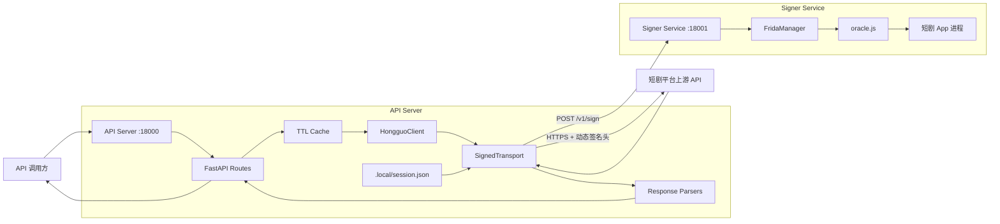
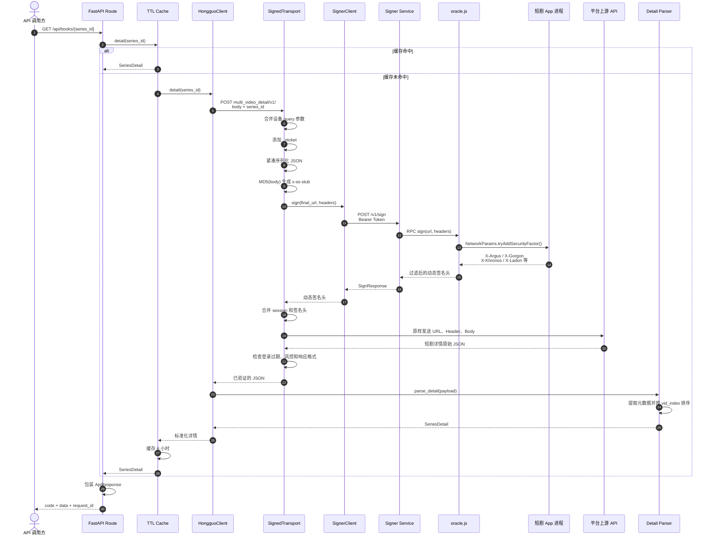

# DramaFlux API Server

API Server 是 DramaFlux 的业务服务层，负责读取设备会话、构造短剧平台请求、
调用 Signer Service 获取动态签名、访问上游接口，并将原始数据转换为稳定的
本地 HTTP API。

API Server 不导入 Frida、ADB 或 MuMu 实现。设备控制和 App 进程内签名全部由
Signer Service 负责，因此两个服务可以独立部署。

## 核心能力

- 短剧搜索及搜索游标。
- 今日上新列表。
- 热门、推荐、新剧排行榜。
- 短剧详情和有序剧集列表。
- 单集视频模型与清晰度选择。
- CENC 加密流识别。
- 会话持久化、TTL 缓存和统一错误响应。

## 服务架构



## 完整请求流程

以下以获取短剧详情为例：

```http
GET /api/books/7647789981687106622
```



签名链路遵循一个关键约束：

> Signer 看见的最终 URL、Header 和请求体字节，必须与上游实际收到的内容一致。

因此 API Server 会先完成最终 URL 和请求体构造，再请求动态签名。签名完成后不再
修改 URL、`x-ss-stub` 或请求体字节。

## 目录结构

```text
src/hongguo_api/
├── bootstrap_app.py       生产依赖组装和应用入口
├── main.py                FastAPI 应用与异常映射
├── config.py              环境变量配置
├── cache.py               TTL 缓存包装器
├── errors.py              内部错误类型
├── models.py              标准化业务模型
├── api/
│   ├── routes.py          HTTP 路由
│   └── schemas.py         API 响应模型
├── session/
│   ├── parser.py          捕获数据过滤
│   └── storage.py         会话原子读写
├── signer/
│   └── client.py          Signer Service HTTP 客户端
├── upstream/
│   ├── client.py          平台业务接口定义
│   └── transport.py       确定性签名传输
└── parsers/
    ├── search.py
    ├── latest.py
    ├── rank.py
    ├── detail.py
    └── video.py
```

## 开发技术栈

| 技术 | 用途 |
|---|---|
| Python 3.10+ | 服务端开发语言 |
| uv | Python 版本、依赖和 workspace 管理 |
| FastAPI | HTTP API、参数校验和异常处理 |
| Uvicorn | ASGI 生产/开发服务器 |
| Pydantic v2 | 请求、响应、会话和业务模型校验 |
| pydantic-settings | 环境变量配置 |
| httpx | Signer Service 与上游异步 HTTP 调用 |
| cachetools | 内存 TTL 缓存 |
| hongguo-contracts | API Server 与 Signer Service 的共享协议模型 |
| pytest | 单元测试和集成测试 |
| pytest-asyncio | 异步测试 |
| respx | httpx 请求 Mock |
| Ruff | 代码检查 |

生产依赖定义在 `services/api-server/pyproject.toml`：

```toml
dependencies = [
  "cachetools>=5.5",
  "fastapi>=0.115",
  "hongguo-contracts",
  "httpx>=0.28",
  "pydantic-settings>=2.7",
  "uvicorn>=0.34",
]
```

## 环境变量

可参考 `.env.example`：

```dotenv
HONGGUO_API_SIGNER_URL=http://127.0.0.1:18001
HONGGUO_API_SIGNER_TOKEN=local-development
HONGGUO_API_SESSION_FILE=.local/session.json
HONGGUO_API_TIMEOUT_SECONDS=30
```

| 变量 | 默认值 | 说明 |
|---|---|---|
| `HONGGUO_API_SIGNER_URL` | `http://127.0.0.1:18001` | Signer Service 地址 |
| `HONGGUO_API_SIGNER_TOKEN` | `local-development` | 服务间 Bearer Token |
| `HONGGUO_API_SESSION_FILE` | `.local/session.json` | 会话快照路径 |
| `HONGGUO_API_TIMEOUT_SECONDS` | `30` | HTTP 超时秒数 |

生产环境应将默认 token 替换为随机长字符串，并保证 API Server 和 Signer
Service 使用相同 token。

## 启动前准备

1. 启动 MuMu 和 Signer Service。
2. 确认 Signer 健康：

   ```powershell
   Invoke-RestMethod http://127.0.0.1:18001/v1/health
   ```

   预期：

   ```json
   {
     "ready": true,
     "app_pid": 22545
   }
   ```

3. 设置与 Signer 相同的 token：

   ```powershell
   $env:HONGGUO_API_SIGNER_TOKEN="local-development"
   ```

4. 捕获当前 App 会话。

## 会话捕获脚本

脚本：

```text
services/api-server/scripts/capture_session.ps1
```

基本用法：

```powershell
$env:HONGGUO_API_SIGNER_TOKEN="local-development"
.\services\api-server\scripts\capture_session.ps1
```

脚本会请求：

```http
POST http://127.0.0.1:18001/v1/session/capture
```

调用后需要在 App 中触发一次自然请求，例如打开排行榜、搜索或详情页面。捕获成功后
会话会保存到：

```text
.local/session.json
```

完整参数：

```powershell
.\services\api-server\scripts\capture_session.ps1 `
  -SignerUrl "http://127.0.0.1:18001" `
  -Token "local-development" `
  -OutputPath ".local/session.json" `
  -TimeoutMs 30000
```

会话文件可能包含设备标识、cookie 或 token，不应提交到 Git、写入日志或对外共享。

## API Server 启动脚本

脚本：

```text
services/api-server/scripts/start.ps1
```

从项目根目录执行：

```powershell
$env:HONGGUO_API_SIGNER_TOKEN="local-development"
.\services\api-server\scripts\start.ps1
```

脚本内部等价于：

```powershell
uv run --project services/api-server `
  uvicorn hongguo_api.bootstrap_app:app `
  --host 127.0.0.1 `
  --port 18000
```

可覆盖启动参数：

```powershell
.\services\api-server\scripts\start.ps1 `
  -HostAddress "127.0.0.1" `
  -Port 18000
```

默认仅监听回环地址，不应直接作为匿名公网服务暴露。

## API 接口

```text
GET /health
GET /api/search?q=&cursor=
GET /api/latest?genre=short_play&today_only=true&cursor=
GET /api/rank?board=hot&cursor=
GET /api/books/{series_id}
GET /api/books/{series_id}/episodes
GET /api/videos/{video_id}?quality=1080p
```

示例：

```powershell
Invoke-RestMethod "http://127.0.0.1:18000/api/rank?board=hot"

Invoke-RestMethod `
  "http://127.0.0.1:18000/api/books/7647789981687106622"

Invoke-RestMethod `
  "http://127.0.0.1:18000/api/videos/7647791842397801534?quality=1080p"
```

成功响应格式：

```json
{
  "code": 200,
  "message": "success",
  "data": {},
  "cached": false,
  "request_id": "19f9550e-5b77-4131-850d-768ee73f4c95"
}
```

## 视频模型与加密流

视频解析器支持：

- 不同清晰度选择和向下回退。
- Base64 编码播放地址。
- `video_list` 数组或对象结构。
- 备用播放地址。
- CENC 加密标记检测。

当上游仅提供 CENC 加密流时，API 返回：

```http
HTTP/1.1 422 Unprocessable Entity
```

```json
{
  "code": "encrypted_stream_unsupported",
  "message": "encrypted stream is not supported",
  "request_id": null
}
```

DramaFlux 不实现 DRM 或 CENC 解密。

## 缓存

默认缓存时间：

| 数据 | TTL |
|---|---:|
| 搜索 | 5 分钟 |
| 今日上新 | 10 分钟 |
| 排行榜 | 10 分钟 |
| 剧集详情 | 6 小时 |
| 视频模型 | 30 分钟 |

缓存 key 包含搜索词、cursor、榜单类型、`series_id`、`video_id` 和清晰度等业务参数。
失败请求不会写入缓存。

## 错误响应

常见稳定错误码：

| HTTP 状态 | 错误码 | 含义 |
|---:|---|---|
| 400 | `invalid_cursor` | 分页 cursor 无效 |
| 401 | `session_expired` | App 会话已过期 |
| 404 | `book_not_found` | 短剧不存在 |
| 404 | `video_not_found` | 视频不存在 |
| 422 | `encrypted_stream_unsupported` | 仅存在加密视频流 |
| 429 | `risk_controlled` | 上游触发风控 |
| 502 | `upstream_invalid_response` | 上游响应格式异常 |
| 503 | `session_missing` | 尚未捕获会话 |
| 503 | `signer_unavailable` | Signer Service 不可用 |
| 504 | `upstream_timeout` | 上游请求超时 |

错误响应不会直接暴露 cookie、token、签名 URL 或上游响应正文。

## 开发与测试

从项目根目录执行：

```powershell
$env:UV_CACHE_DIR="D:\Codex\hongguo-video\.uv-cache"

uv sync --all-packages
uv run pytest services/api-server/tests -q
uv run ruff check services/api-server
```

真实环境测试默认跳过。只有显式设置后才会访问本机服务和上游：

```powershell
$env:HONGGUO_RUN_LIVE_TESTS="1"
$env:HONGGUO_LIVE_SERIES_ID="7647789981687106622"
uv run pytest services/api-server/tests/live -v
```

## 当前限制

- 搜索和今日上新的真实响应仍可能随 App 版本调整，需要持续维护解析器。
- latest/rank 的分页 cursor 尚未完整接入上游翻页参数。
- `/health` 当前只表示 API 进程可用，尚未汇总 Signer 和 session 状态。
- `cached` 字段目前尚未反馈真实缓存命中状态。
- 不支持 DRM/CENC 解密、批量下载或视频代理。
