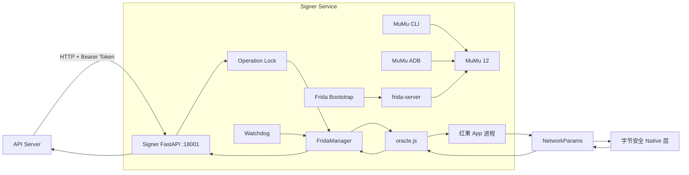
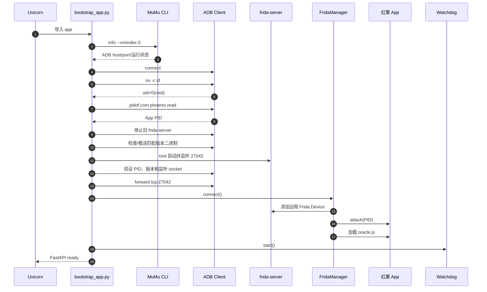
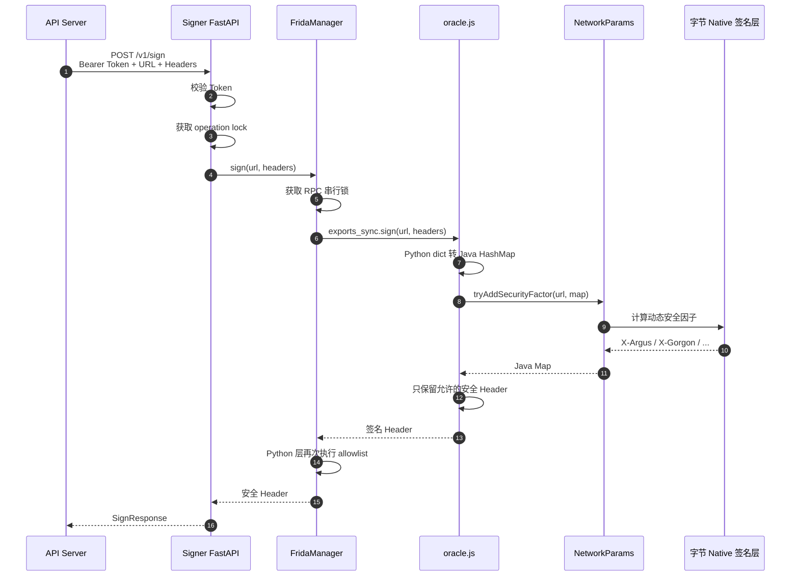

# DramaFlux Signer Service

Signer Service 是 DramaFlux 的设备侧动态签名服务。它负责管理 MuMu 模拟器、
ADB、root、`frida-server` 和红果 App 进程，并通过 App 内部的字节安全组件生成
短期有效的动态签名 Header。

Signer Service 不负责搜索、排行榜、短剧详情或视频解析。这些业务逻辑由
API Server 负责，因此两个服务可以独立部署。

## 核心能力

- 动态发现 MuMu 实例和 ADB 端口。
- 验证模拟器 root 权限和目标 App 进程。
- 部署、启动并验证匹配版本的 `frida-server`。
- 附加红果 App，加载 `oracle.js`。
- 生成 `X-Argus`、`X-Gorgon`、`X-Ladon` 等动态签名。
- 观察 App 自然请求，捕获设备参数和会话 Header。
- 检测 App 重启、PID 变化和 Frida session 断开。
- 通过 Watchdog 自动重新附加。
- 通过 Bearer Token 保护签名接口。

## 服务架构



## 启动流程



## 完整签名流程

以 API Server 请求动态签名为例：



项目没有在 Python 中重新实现 X-Argus 或 X-Gorgon 算法。实际计算由红果 App
内部的 Java/Native 安全组件完成。

## 目录结构

```text
src/hongguo_signer/
├── bootstrap_app.py          生产依赖组装和启动入口
├── main.py                   Signer HTTP API
├── config.py                 环境变量配置
├── security.py               签名和会话 Header allowlist
├── device/
│   ├── mumu_cli.py           MuMu 实例发现和 JSON 解析
│   ├── adb.py                安全的 ADB 命令封装
│   └── manager.py            设备环境检查
└── frida_runtime/
    ├── bootstrap.py          frida-server 部署和验证
    ├── manager.py            attachment、RPC 和超时管理
    ├── watchdog.py           健康检查和自动恢复
    └── oracle.js             App 进程内 JavaScript Agent
```

## 开发技术栈

| 技术 | 用途 |
|---|---|
| Python 3.10+ | Signer HTTP 服务和设备编排 |
| uv | Python、依赖和 workspace 管理 |
| FastAPI | Signer HTTP API 和参数校验 |
| Uvicorn | ASGI 服务运行器 |
| Pydantic v2 | 跨服务请求、响应和 session 模型 |
| pydantic-settings | 环境变量配置 |
| Frida Python 16.7.19 | 连接 `frida-server`、attach 和 RPC |
| Frida Server 16.7.19 | Android 设备侧注入服务 |
| Frida GumJS | 执行 `oracle.js` |
| Java Bridge | 调用 App 内部 Java 类和方法 |
| MuMu CLI | 发现模拟器实例和动态 ADB 端口 |
| ADB | 设备连接、文件推送、root shell 和端口转发 |
| hongguo-contracts | API Server 与 Signer 的共享 HTTP 协议 |
| pytest | 单元和集成测试 |
| Ruff | Python 代码检查 |

生产依赖：

```toml
dependencies = [
  "fastapi>=0.115",
  "frida==16.7.19",
  "hongguo-contracts",
  "pydantic-settings>=2.7",
  "uvicorn>=0.34",
]
```

## 为什么固定 Frida 16.7.19

当前 `oracle.js` 使用 GumJS 内置的：

```javascript
Java.perform(...)
Java.use(...)
```

Frida 17 默认不再内置相同形式的 Java Bridge，需要额外引入
`frida-java-bridge` 并使用 `frida-compile` 构建 Agent。

为了让源码形式的 `oracle.js` 可以直接加载，项目当前固定：

```text
Python frida     16.7.19
Android server   16.7.19
```

两个版本必须完全一致。

## 配置

环境变量使用 `HONGGUO_SIGNER_` 前缀。

```dotenv
HONGGUO_SIGNER_MUMU_HOME=D:\MuMu Player 12
HONGGUO_SIGNER_VMINDEX=0
HONGGUO_SIGNER_PACKAGE_NAME=com.phoenix.read
HONGGUO_SIGNER_FRIDA_HOST=127.0.0.1
HONGGUO_SIGNER_FRIDA_PORT=27042
HONGGUO_SIGNER_FRIDA_SERVER_PATH=D:\Codex\hongguo-video\services\signer-service\bin\frida-server-16.7.19-android-x86_64
HONGGUO_SIGNER_FRIDA_REMOTE_PATH=/data/local/tmp/frida-server
HONGGUO_SIGNER_WATCHDOG_INTERVAL=15
HONGGUO_SIGNER_SERVICE_TOKEN=local-development
```

| 变量 | 默认值 | 说明 |
|---|---|---|
| `HONGGUO_SIGNER_MUMU_HOME` | `D:\MuMu Player 12` | MuMu 安装目录 |
| `HONGGUO_SIGNER_VMINDEX` | `0` | MuMu 实例编号 |
| `HONGGUO_SIGNER_PACKAGE_NAME` | `com.phoenix.read` | 目标 App 包名 |
| `HONGGUO_SIGNER_FRIDA_HOST` | `127.0.0.1` | Frida 转发地址 |
| `HONGGUO_SIGNER_FRIDA_PORT` | `27042` | Frida 服务端口 |
| `HONGGUO_SIGNER_FRIDA_SERVER_PATH` | 自动按版本生成 | 本地 Frida Server |
| `HONGGUO_SIGNER_FRIDA_REMOTE_PATH` | `/data/local/tmp/frida-server` | Android 目标路径 |
| `HONGGUO_SIGNER_WATCHDOG_INTERVAL` | `15` | 健康检查间隔秒数 |
| `HONGGUO_SIGNER_SERVICE_TOKEN` | `local-development` | 服务间 Bearer Token |

生产环境必须替换默认 token。

## 前置条件

### 1. MuMu 12

默认安装目录：

```text
D:\MuMu Player 12
```

必须启用：

- ADB 调试。
- root 权限。

红果 App 必须已安装并保持运行。

### 2. Frida Server

将 Android x86_64 二进制放到：

```text
services/signer-service/bin/frida-server-16.7.19-android-x86_64
```

检查 Python 版本：

```powershell
$env:UV_CACHE_DIR="D:\Codex\hongguo-video\.uv-cache"
uv run --project services/signer-service `
  python -c "import frida; print(frida.__version__)"
```

预期：

```text
16.7.19
```

## 环境检查脚本

脚本：

```text
services/signer-service/scripts/check_environment.ps1
```

执行：

```powershell
.\services\signer-service\scripts\check_environment.ps1
```

脚本会检查：

- `mumu-cli.exe` 是否存在。
- MuMu 内置 `adb.exe` 是否存在。
- 本地 `frida-server` 是否存在。
- Python Frida 与 Server 版本是否一致。
- MuMu 实例状态。
- ADB 连接状态。
- root 是否可用。
- 红果 App PID 是否存在。

正常输出中应包含：

```text
root_ready=True
app_pid=<红果 PID>
```

## 启动脚本

脚本：

```text
services/signer-service/scripts/start.ps1
```

从项目根目录执行：

```powershell
$env:HONGGUO_SIGNER_SERVICE_TOKEN="local-development"
.\services\signer-service\scripts\start.ps1
```

脚本内部等价于：

```powershell
uv run --project services/signer-service `
  uvicorn hongguo_signer.bootstrap_app:app `
  --host 127.0.0.1 `
  --port 18001
```

可以覆盖地址和端口：

```powershell
.\services\signer-service\scripts\start.ps1 `
  -HostAddress "127.0.0.1" `
  -Port 18001
```

启动时会自动：

1. 发现 MuMu ADB 地址。
2. 连接 ADB。
3. 验证 root。
4. 检查红果进程。
5. 替换并启动匹配版本的 `frida-server`。
6. 配置 ADB 端口转发。
7. attach 红果 PID。
8. 加载 `oracle.js`。
9. 启动 Watchdog。
10. 启动 HTTP 服务。

## 健康检查

```powershell
Invoke-RestMethod http://127.0.0.1:18001/v1/health
```

正常响应：

```json
{
  "ready": true,
  "app_pid": 22545
}
```

`ready=true` 表示：

- Frida attachment 存在。
- `oracle.js` 已加载。
- Java Bridge 可用。
- `NetworkParams` 类可以访问。

## HTTP API

```text
GET  /v1/health
POST /v1/sign
POST /v1/session/capture
POST /v1/admin/reconnect
```

除 `/v1/health` 外均要求：

```http
Authorization: Bearer <service-token>
```

### 动态签名

```http
POST /v1/sign
Content-Type: application/json
Authorization: Bearer local-development
```

请求：

```json
{
  "url": "https://api5-normal-sinfonlineb.fqnovel.com/path?device_id=1&_rticket=123",
  "headers": {
    "user-agent": "com.phoenix.read/70533 ...",
    "x-ss-stub": "F4A..."
  }
}
```

响应：

```json
{
  "headers": {
    "X-Argus": "...",
    "X-Gorgon": "...",
    "X-Khronos": "...",
    "X-Ladon": "..."
  },
  "app_pid": 22545,
  "signed_at": "2026-06-12T13:32:01Z"
}
```

浏览器地址栏直接打开 `/v1/sign` 会发送 GET 请求，因此不会执行签名。

### 捕获会话

```http
POST /v1/session/capture?timeout_ms=30000
Authorization: Bearer local-development
```

调用后需要在红果 App 内打开排行榜、搜索或详情页面，触发一次自然请求。

Signer 会临时 Hook：

```text
NetworkParams.tryAddSecurityFactor(String, Map)
```

只捕获符合以下条件的请求：

- HTTPS `fqnovel.com` 域名。
- URL 包含 `device_id`。
- Header 包含 `x-ss-req-ticket`。

捕获成功后返回：

```json
{
  "api_host": "api5-normal-sinfonlineb.fqnovel.com",
  "base_query": {
    "device_id": "...",
    "iid": "...",
    "aid": "8662"
  },
  "session_headers": {
    "user-agent": "...",
    "x-tt-store-region": "cn-zj"
  },
  "captured_at": "2026-06-12T13:33:17Z"
}
```

### 手工重连

```powershell
Invoke-RestMethod `
  -Method Post `
  -Uri http://127.0.0.1:18001/v1/admin/reconnect `
  -Headers @{ Authorization = "Bearer local-development" }
```

## FridaManager

`FridaManager` 管理：

```text
Frida Device
App attachment
oracle.js Script
App PID
RPC worker
RPC timeout
detached 事件
```

运行状态：

| 状态 | 含义 |
|---|---|
| `idle` | 已连接，当前没有 RPC |
| `active` | RPC 正常执行中 |
| `stale` | attachment 或 Script 已失效 |
| `busy_hung` | RPC 已超时但底层同步调用尚未退出 |

所有 RPC 串行执行。超时后 attachment 会被标记失效，防止无限创建挂死线程。

## Watchdog

Watchdog 默认每 15 秒调用一次：

```python
runtime.health()
```

失败后执行：

```python
runtime.reconnect()
```

它可以处理：

- 红果 App 重启。
- App PID 变化。
- Frida session detached。
- `oracle.js` RPC 失效。

Watchdog 恢复失败不会终止进程，下一个周期会继续尝试。

## 安全设计

### Header allowlist

签名接口只允许返回：

```text
X-Argus
X-Gorgon
X-Ladon
X-Khronos
X-Helios
X-Medusa
X-SS-REQ-TICKET
```

会话捕获只允许返回：

```text
cookie
x-tt-token
user-agent
x-tt-store-region
x-tt-store-region-src
passport-sdk-version
sdk-version
```

签名接口不会返回 cookie，会话接口也不会保存短期动态签名。

### 并发限制

签名、会话捕获和手工重连共享一个非阻塞操作锁。如果已有操作执行，返回：

```http
HTTP/1.1 409 Conflict
```

```json
{
  "code": "signer_busy",
  "message": "signer is busy"
}
```

### 网络暴露

默认只监听：

```text
127.0.0.1:18001
```

Signer Service 拥有生成动态签名的能力，不应作为匿名公网服务暴露。远程部署应使用
VPN、私有隧道或双向认证，并增加时间戳、HMAC 和来源 allowlist。

## 错误响应

| HTTP 状态 | 错误码 | 含义 |
|---:|---|---|
| 401 | `unauthorized` | Bearer Token 错误 |
| 409 | `signer_busy` | 已有签名/捕获/重连操作 |
| 503 | `signer_unavailable` | Frida 或 App 不可用 |
| 504 | `signer_timeout` | Frida RPC 超时 |

所有响应都设置：

```text
Cache-Control: no-store
X-Content-Type-Options: nosniff
X-Frame-Options: DENY
Referrer-Policy: no-referrer
```

## 测试

```powershell
$env:UV_CACHE_DIR="D:\Codex\hongguo-video\.uv-cache"

uv sync --all-packages
uv run pytest services/signer-service/tests -q
uv run ruff check services/signer-service
```

真实签名测试默认跳过。启用前必须先启动 Signer：

```powershell
$env:HONGGUO_RUN_LIVE_TESTS="1"
$env:HONGGUO_SIGNER_SERVICE_TOKEN="local-development"
uv run pytest services/signer-service/tests/live -v
```

## 常见问题

### `ready=false`

检查：

```powershell
& "D:\MuMu Player 12\shell\adb.exe" -s 127.0.0.1:16384 shell `
  "pidof com.phoenix.read"
```

然后尝试 `/v1/admin/reconnect`。

### Frida 版本不一致

```powershell
uv run --project services/signer-service `
  python -c "import frida; print(frida.__version__)"

& "D:\MuMu Player 12\shell\adb.exe" -s 127.0.0.1:16384 shell `
  "su -c '/data/local/tmp/frida-server --version'"
```

两者必须都是 `16.7.19`。

### 找不到红果进程

确认 App 已打开：

```powershell
& "D:\MuMu Player 12\shell\adb.exe" -s 127.0.0.1:16384 shell `
  "pidof com.phoenix.read"
```

### Session 捕获超时

在捕获等待期间主动打开红果排行榜、搜索或详情页面，确保产生新的自然网络请求。

## 当前范围

Signer Service 当前只适配：

```text
MuMu 12
Android x86_64
红果包名 com.phoenix.read
Frida 16.7.19
NetworkParams.tryAddSecurityFactor
```

未来扩展其他短剧 App 时，可以保留 HTTP API 和 FridaManager，把设备配置、
目标包名和 `oracle.js` 签名入口改为平台适配器。
